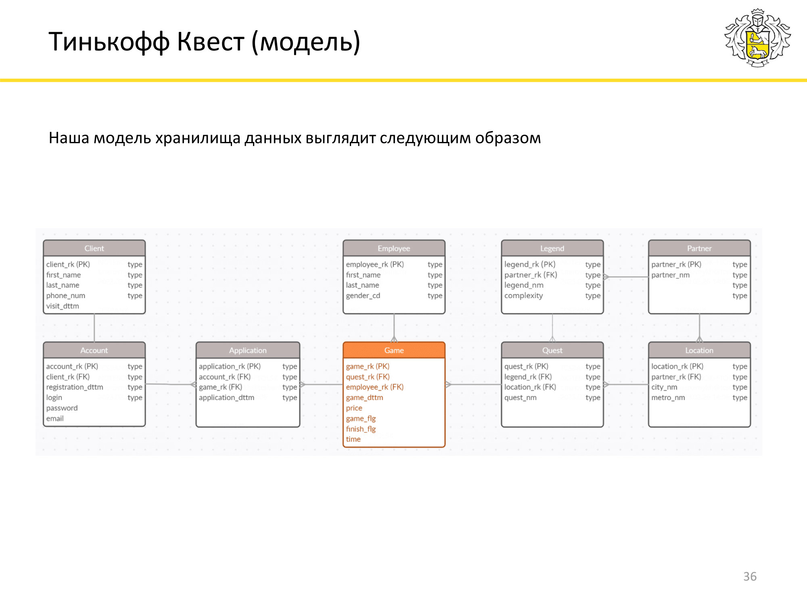

# Анализ воронки продукта

Проект по анализу воронки продукта, который был выполнен мной в рамках прохождения курса  «Анализ данных в индустрии 2023» от Т-Банка.

В jupyter notebook используется **интерактивная визуализация** с помощью `plotly`, поэтому чтобы увидеть графики, пожалуйста, воспользуйтесь [**nbviewer**](https://nbviewer.org/github/NikitaNikitchenko/Funnel-Analysis/blob/main/Funnel_project.ipynb) для просмотра ноутбука.

## Информация о курсе
Курс предназначен для студентов 2-5 курсов технических специальностей, интересующихся аналитикой. Лекции читают техлиды Тинькофф, которые учат работать с данными и принимать эффективные продуктовые решения. Цель курса - научить студентов использовать имеющиеся теоретические знания для решения реальных практических задач из бизнеса.

## Описание задания
Для того чтобы отслеживать, как выглядит путь клиента от знакомства с продуктом до его получения, и какие в нем есть проблемные места, аналитики часто строят воронки. Этот инструмент позволяет понять, сколько клиентов «теряется» на каждом из этапов процесса и сколько в итоге совершает целевое действие.

Перед вами схема данных проекта Тинькофф квест. Постройте воронку, которая показывала бы в динамике по неделям и месяцам, сколько клиентов посещает наш сайт, и какая доля из них регистрируется на нем \ подает заявку на игру \ по факту приходит на нее. Количество клиентов и конверсии необходимо изобразить на одном графике.

Какие выводы можно сделать исходя из построенной воронки, какие точки роста продукта вы видите?

Информация о схеме данных содержится в файле `Database_info.pdf`
